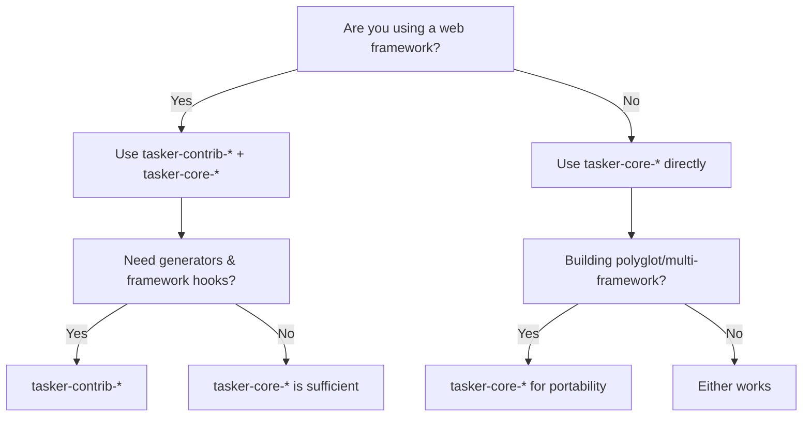

# TAS-66 Updated Documentation Plan

## Context: Migration to MkDocs Material

The legacy GitBook (Node.js open-source version) is abandoned and presents maintenance risks. We're migrating to **MkDocs Material**, which provides:

- Active maintenance with 50k+ users
- Native content tabs with site-wide linking (perfect for Core/Contrib switching)
- Python-native tooling
- Fast builds, excellent search, modern theming

### The Core vs Contrib Split

With tasker-contrib now established, we have a clear separation:

| Layer | Purpose | Examples |
|-------|---------|----------|
| **Tasker Core** | Foundation - framework-agnostic | tasker-core-rb, tasker-core-py, tasker-core-ts |
| **Tasker Contrib** | Developer Experience - framework-specific | tasker-contrib-rails, tasker-contrib-fastapi, tasker-contrib-bun |

This split creates a documentation challenge: **which library should blog examples use?**

---

## The Disambiguation Problem

Users landing on our documentation will ask:

> "I'm building a Rails app. Should I use `tasker-core-rb` or `tasker-contrib-rails`?"

**Answer:** Both, but understand what each provides:

| Use Case | Recommendation |
|----------|----------------|
| Learning Tasker concepts | tasker-core-* (pure API, no framework sugar) |
| Production Rails app | tasker-contrib-rails + tasker-core-rb |
| Polyglot/multi-framework | tasker-core-* (portable across frameworks) |
| CI/testing | tasker-core-* (minimal dependencies) |
| Generators, initializers | tasker-contrib-* (framework integration) |

**The rule:** Tasker Contrib is a thin wrapper that makes Tasker Core more ergonomic within a specific framework. You always use Core under the hood.

---

## Blog Examples: Progressive Disclosure Approach

Rather than choosing Core OR Contrib, we use **progressive disclosure**:

### Pattern: Foundation → Enhancement

Each blog post shows:
1. **The Core approach** - Framework-agnostic, works everywhere
2. **The Contrib enhancement** - Framework-specific ergonomics (where applicable)

This teaches fundamentals while demonstrating the developer experience improvement.

### Updated Story Mapping

| Story | Primary Language | Core Example | Contrib Enhancement |
|-------|------------------|--------------|---------------------|
| 01: E-commerce Checkout | Ruby | tasker-core-rb handlers | tasker-contrib-rails generators |
| 02: Data Pipeline | Python | tasker-core-py handlers | tasker-contrib-fastapi lifespan hooks |
| 03: Microservices | TypeScript | tasker-core-ts handlers | tasker-contrib-bun Bun.serve integration |
| 04: Team Scaling | All 4 (tabs) | Core only (polyglot focus) | N/A - demonstrates framework independence |
| 05: Observability | Rust + Ruby | OTel (Rust), Domain Events (Ruby Core) | AS::Notifications bridge (Rails Contrib) |
| 06: Batch Processing | Rust | tasker-core Rust worker | N/A - Rust doesn't need framework sugar |
| 07: Conditional Workflows | Python | tasker-core-py decision handlers | tasker-contrib-fastapi testing fixtures |
| 08: Production Debugging | Ruby | Core DLQ investigation | Contrib Rails console integration |

### Example: Post 01 Structure with MkDocs Tabs

```markdown
# E-commerce Checkout Reliability

## The Handler Implementation

=== "Core (Pure)"

    Using tasker-core-rb directly:

    ```ruby
    class PaymentHandler < TaskerCore::StepHandler::Base
      def call(context)
        # Implementation
      end
    end
    ```

=== "Rails"

    With tasker-contrib-rails, you get generators:

    ```bash
    rails generate tasker:step_handler Payment --type api
    ```

    This creates the handler AND:

    - Registers with Spring for auto-reload
    - Adds to handler registry initializer
    - Creates RSpec scaffolding
```

**Key benefit:** MkDocs Material's linked tabs mean if a user clicks "Rails" here, ALL tabs across the entire documentation site switch to "Rails".

---

## Updated MkDocs Structure

```
tasker-docs/                          # Renamed from tasker-gitbook
├── mkdocs.yml                        # Main configuration
├── docs/
│   ├── index.md                      # "What is Tasker?"
│   │
│   ├── getting-started/
│   │   ├── index.md
│   │   ├── quick-start.md            # Points to tasker-core
│   │   ├── concepts.md               # Core vocabulary
│   │   └── choosing-your-stack.md    # Core vs Contrib decision tree
│   │
│   ├── ecosystem/                    # Package documentation
│   │   ├── index.md                  # Overview of all packages
│   │   ├── core/
│   │   │   ├── index.md
│   │   │   ├── ruby.md               # tasker-core-rb
│   │   │   ├── python.md             # tasker-core-py
│   │   │   ├── typescript.md         # tasker-core-ts
│   │   │   └── rust.md               # tasker-worker (Rust)
│   │   ├── contrib/
│   │   │   ├── index.md
│   │   │   ├── rails.md              # tasker-contrib-rails
│   │   │   ├── fastapi.md            # tasker-contrib-fastapi
│   │   │   ├── bun.md                # tasker-contrib-bun
│   │   │   └── axum.md               # tasker-contrib-axum
│   │   └── disambiguation.md         # When to use what
│   │
│   ├── stories/                      # Narrative blog series
│   │   ├── index.md
│   │   ├── 01-ecommerce-reliability/
│   │   │   ├── index.md              # The story
│   │   │   └── implementation.md     # Core + Contrib tabs
│   │   ├── 02-data-pipeline-resilience/
│   │   │   └── ...
│   │   └── ...
│   │
│   ├── reference/                    # SYNCED from tasker-core/docs
│   │   ├── index.md
│   │   ├── architecture/
│   │   ├── guides/
│   │   ├── workers/
│   │   ├── principles/
│   │   ├── decisions/
│   │   └── observability/
│   │
│   └── api/                          # GENERATED from code
│       ├── core/
│       │   ├── rust/                 # cargo doc
│       │   ├── ruby/                 # YARD
│       │   ├── python/               # pdoc
│       │   └── typescript/           # TypeDoc
│       └── contrib/
│           ├── rails/                # YARD
│           ├── fastapi/              # pdoc
│           ├── bun/                  # TypeDoc
│           └── axum/                 # cargo doc
│
├── overrides/                        # Theme customization
│   └── main.html
└── requirements.txt                  # Python dependencies
```

---

## MkDocs Configuration

### mkdocs.yml

```yaml
site_name: Tasker Documentation
site_url: https://docs.tasker.dev
site_description: Transform complex, fragile processes into reliable, observable workflows

repo_name: tasker-systems/tasker-core
repo_url: https://github.com/tasker-systems/tasker-core
edit_uri: edit/main/docs/

theme:
  name: material
  palette:
    - scheme: default
      primary: indigo
      accent: indigo
      toggle:
        icon: material/brightness-7
        name: Switch to dark mode
    - scheme: slate
      primary: indigo
      accent: indigo
      toggle:
        icon: material/brightness-4
        name: Switch to light mode
  features:
    - navigation.tabs           # Top-level navigation as tabs
    - navigation.tabs.sticky    # Tabs stay visible when scrolling
    - navigation.sections       # Render sections as groups
    - navigation.expand         # Expand all sections by default
    - navigation.indexes        # Section index pages
    - content.tabs.link         # CRITICAL: Link all tabs across site
    - content.code.copy         # Copy button on code blocks
    - content.code.annotate     # Code annotations
    - search.suggest            # Search suggestions
    - search.highlight          # Highlight search terms

markdown_extensions:
  # Code blocks and tabs
  - pymdownx.highlight:
      anchor_linenums: true
      line_spans: __span
      pygments_lang_class: true
  - pymdownx.inlinehilite
  - pymdownx.snippets
  - pymdownx.superfences
  - pymdownx.tabbed:
      alternate_style: true     # Required for content tabs

  # Admonitions (callouts)
  - admonition
  - pymdownx.details

  # Other useful extensions
  - attr_list
  - md_in_html
  - tables
  - toc:
      permalink: true

plugins:
  - search
  - git-revision-date-localized:
      enable_creation_date: true

nav:
  - Home: index.md
  - Getting Started:
    - getting-started/index.md
    - Quick Start: getting-started/quick-start.md
    - Concepts: getting-started/concepts.md
    - Choosing Your Stack: getting-started/choosing-your-stack.md
  - Ecosystem:
    - ecosystem/index.md
    - Core:
      - ecosystem/core/index.md
      - Ruby: ecosystem/core/ruby.md
      - Python: ecosystem/core/python.md
      - TypeScript: ecosystem/core/typescript.md
      - Rust: ecosystem/core/rust.md
    - Contrib:
      - ecosystem/contrib/index.md
      - Rails: ecosystem/contrib/rails.md
      - FastAPI: ecosystem/contrib/fastapi.md
      - Bun: ecosystem/contrib/bun.md
      - Axum: ecosystem/contrib/axum.md
  - Stories:
    - stories/index.md
    - "01: E-commerce Reliability": stories/01-ecommerce-reliability/index.md
    # ... etc
  - Reference:
    - reference/index.md
    # ... synced from tasker-core
  - API:
    - api/index.md
    # ... generated docs
```

---

## Dual-Source Documentation Generation

### From tasker-core

```bash
# scripts/docs/sync-core.sh

#!/bin/bash
set -euo pipefail

CORE_DOCS="../tasker-core/docs"
MKDOCS_REFERENCE="docs/reference"

# Sync markdown documentation
rsync -av --delete \
  --exclude='*.draft.md' \
  "$CORE_DOCS/" "$MKDOCS_REFERENCE/"

# Generate Rust API docs
cd ../tasker-core
cargo doc --no-deps --document-private-items
cp -r target/doc ../tasker-docs/docs/api/core/rust/

# Generate Ruby API docs (YARD)
cd workers/ruby
bundle exec yard doc --output-dir ../../../tasker-docs/docs/api/core/ruby/
```

### From tasker-contrib

```bash
# scripts/docs/sync-contrib.sh

#!/bin/bash
set -euo pipefail

CONTRIB_DOCS="../tasker-contrib/docs"
MKDOCS_ECOSYSTEM="docs/ecosystem/contrib"

# Sync contrib documentation
rsync -av --delete \
  --exclude='ticket-specs/' \
  "$CONTRIB_DOCS/" "$MKDOCS_ECOSYSTEM/"

# Generate Rails API docs
cd ../tasker-contrib/rails/tasker-contrib-rails
bundle exec yard doc --output-dir ../../../tasker-docs/docs/api/contrib/rails/

# Generate FastAPI docs (pdoc)
cd ../../python/tasker-contrib-fastapi
pdoc --html --output-dir ../../../tasker-docs/docs/api/contrib/fastapi/ tasker_contrib_fastapi
```

### Unified Build

```makefile
# Makefile

.PHONY: docs-sync docs-build docs-serve

docs-sync:
	./scripts/docs/sync-core.sh
	./scripts/docs/sync-contrib.sh

docs-build: docs-sync
	pip install -r requirements.txt
	mkdocs build

docs-serve: docs-sync
	pip install -r requirements.txt
	mkdocs serve

docs-deploy: docs-build
	mkdocs gh-deploy --force
```

---

## The Disambiguation Page

`docs/getting-started/choosing-your-stack.md`:

```markdown
# Choosing Your Stack

## Quick Decision Tree



## What Each Package Provides

### Tasker Core (Foundation)

| Package | Provides |
|---------|----------|
| tasker-core-rb | Handler base classes, types, FFI bridge, domain events |
| tasker-core-py | Handler base classes, types, FFI bridge, domain events |
| tasker-core-ts | Handler base classes, types, FFI bridge, domain events |

**Use when:** You want the pure API, minimal dependencies, or framework independence.

### Tasker Contrib (Developer Experience)

| Package | Adds On Top of Core |
|---------|---------------------|
| tasker-contrib-rails | Railtie, generators, AS::Notifications bridge, RSpec helpers |
| tasker-contrib-fastapi | Lifespan integration, Pydantic models, pytest fixtures |
| tasker-contrib-bun | Bun.serve integration, TypeScript helpers |

**Use when:** You want batteries-included experience in your framework.

## Example: The Same Handler

=== "Core Only"

    ```ruby
    # Manual setup required
    require 'tasker_core'

    class PaymentHandler < TaskerCore::StepHandler::Base
      HANDLER_NAME = 'payment'

      def call(context)
        # Implementation
      end
    end

    # Manual registration
    TaskerCore::HandlerRegistry.register(PaymentHandler)
    ```

=== "With Rails Contrib"

    ```bash
    # Generated automatically
    rails generate tasker:step_handler Payment --type api
    ```

    ```ruby
    # config/initializers/tasker.rb (auto-configured)
    Tasker.configure do |config|
      config.auto_discover_handlers = true
    end
    ```

Both produce the same runtime behavior. Contrib adds developer ergonomics.
```

---

## Migration from GitBook

### File Mapping

| GitBook | MkDocs |
|---------|--------|
| `book.json` | `mkdocs.yml` |
| `SUMMARY.md` | `nav:` section in mkdocs.yml |
| `...` | `=== "Tab"` syntax |
| `` | `!!! info` admonition |
| `styles/website.css` | `overrides/` directory |

### Content Migration Script

```python
#!/usr/bin/env python3
# scripts/migrate-gitbook-to-mkdocs.py

import re
from pathlib import Path

def convert_codetabs(content: str) -> str:
    """Convert GitBook codetabs to MkDocs Material tabs."""
    # Pattern: ......
    # This is a simplified converter - may need manual review

    # Replace codetabs start
    content = re.sub(
        r'',
        r'=== "\1"\n',
        content
    )

    # Remove endcodetabs
    content = re.sub(r'', '', content)

    return content

def convert_hints(content: str) -> str:
    """Convert GitBook hints to MkDocs admonitions."""
    # ...
    content = re.sub(
        r'(.*?)',
        r'!!! \1\n    \2',
        content,
        flags=re.DOTALL
    )
    return content

def migrate_file(src: Path, dest: Path):
    content = src.read_text()
    content = convert_codetabs(content)
    content = convert_hints(content)
    dest.parent.mkdir(parents=True, exist_ok=True)
    dest.write_text(content)

if __name__ == '__main__':
    # Migrate all .md files
    for src in Path('gitbook-source').rglob('*.md'):
        dest = Path('docs') / src.relative_to('gitbook-source')
        migrate_file(src, dest)
```

---

## Updated Implementation Phases

| Phase | Effort | Description |
|-------|--------|-------------|
| **1: Setup** | 1-2 days | Create mkdocs.yml, requirements.txt, basic structure |
| **2: Migration** | 2-3 days | Run migration script, manual cleanup of tabs/hints |
| **3: Disambiguation** | 1 day | Write choosing-your-stack.md, ecosystem overview |
| **4: Tooling** | 2 days | Dual-source sync scripts, API doc generation |
| **5: Story Rewrites** | 5-7 days | Convert to linked tabs (Core → Contrib pattern) |
| **6: New Content** | 3-4 days | Posts 06-08 |
| **7: Polish** | 1-2 days | Theme customization, navigation refinement |

**Total estimate:** 15-21 days

---

## Dependencies

| Ticket | Blocks | Notes |
|--------|--------|-------|
| TAS-112 | Post 05 (Observability) | Domain events for dual observability |
| TAS-91 | Story code tabs | Multi-language examples in Core |
| TAS-126 | Contrib docs sync | tasker-contrib structure exists |
| TAS-127 | CLI plugin docs | tasker-cli template generation |

---

## Requirements

```txt
# requirements.txt
mkdocs>=1.5
mkdocs-material>=9.5
mkdocs-git-revision-date-localized-plugin>=1.2
pymdown-extensions>=10.0
```

---

## Success Criteria

- [ ] Users can find "which package do I need?" answer in < 30 seconds
- [ ] Each blog post shows Core foundation + Contrib enhancement with linked tabs
- [ ] Clicking a tab (e.g., "Rails") switches ALL tabs site-wide
- [ ] Documentation syncs automatically from both repos
- [ ] API docs generated for Core (Rust, Ruby) and Contrib from day one
- [ ] Dark mode toggle works correctly
- [ ] Search returns relevant results instantly
- [ ] Builds complete in < 60 seconds
