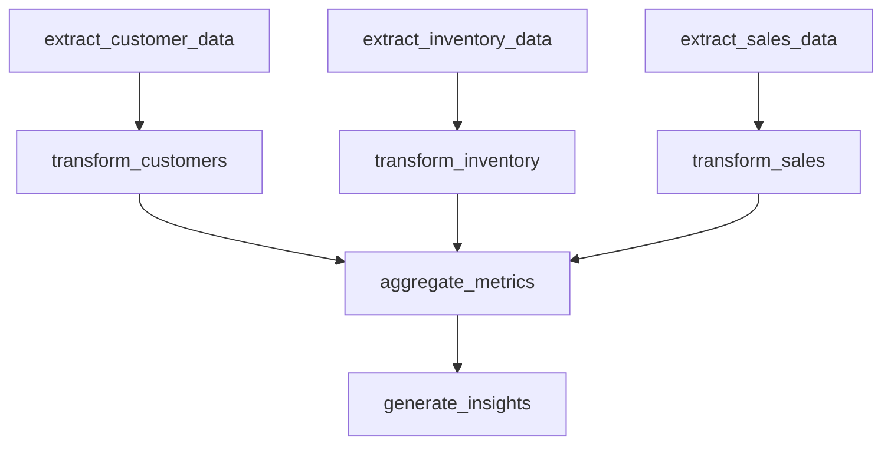

# analytics_pipeline

## Step Details

| Step | Type | Handler | Dependencies | Schema Fields | Retry |
|------|------|---------|--------------|---------------|-------|
| extract_customer_data | Standard | data_pipeline_extract_customers | — | avg_lifetime_value, extracted_at, low_stock_alerts, record_count, records, source, tier_breakdown, total_customers, total_inventory_value, total_lifetime_value | — |
| extract_inventory_data | Standard | data_pipeline_extract_inventory | — | extracted_at, overall_conversion_rate, products_tracked, record_count, records, source, total_conversions, total_quantity, total_sessions, warehouses | — |
| extract_sales_data | Standard | data_pipeline_extract_sales | — | date_range, extracted_at, record_count, records, source, total_amount, total_quantity, total_revenue | — |
| transform_customers | Standard | data_pipeline_transform_customers | extract_customer_data | avg_customer_value, by_category, by_warehouse, low_stock_count, low_stock_items, record_count, records_processed, tier_analysis, total_lifetime_value, total_skus, transformed_at, value_segments | 2x exponential |
| transform_inventory | Standard | data_pipeline_transform_inventory | extract_inventory_data | best_converting_source, by_page, by_source, product_inventory, record_count, records_processed, reorder_alerts, total_pages, total_quantity_on_hand, total_sources, transformed_at, warehouse_summary | 2x exponential |
| transform_sales | Standard | data_pipeline_transform_sales | extract_sales_data | by_category, by_region, daily_sales, product_sales, record_count, records_processed, top_category, total_categories, total_regions, total_revenue, transformed_at | 2x exponential |
| aggregate_metrics | Standard | data_pipeline_aggregate_metrics | transform_sales, transform_inventory, transform_customers | aggregated_at, aggregation_complete, data_sources, inventory_reorder_alerts, inventory_summary, inventory_turnover_indicator, revenue_per_customer, sales_summary, sales_transactions, sources_included, total_customer_lifetime_value, total_customers, total_inventory_quantity, total_records_processed, total_revenue, traffic_summary | 2x exponential |
| generate_insights | Standard | data_pipeline_generate_insights | aggregate_metrics | generated_at, health_score, health_status, insight_count, insights, pipeline_complete, recommendations_count, total_metrics_analyzed | 2x exponential |
