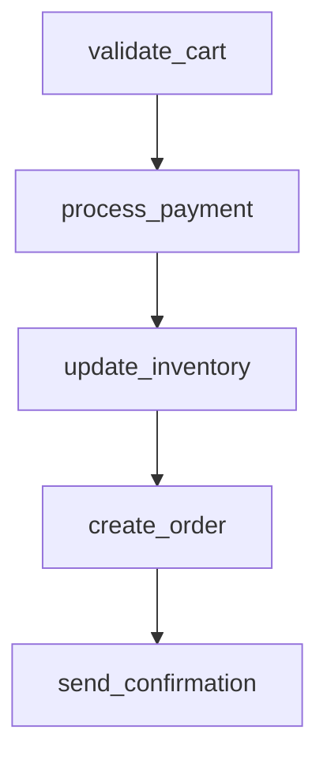

# ecommerce_order_processing

## Step Details

| Step | Type | Handler | Dependencies | Schema Fields | Retry |
|------|------|---------|--------------|---------------|-------|
| validate_cart | Standard | ecommerce_validate_cart | — | item_count, shipping, subtotal, tax, tax_rate, total, validated_at, validated_items | 2x exponential |
| process_payment | Standard | ecommerce_process_payment | validate_cart | amount_charged, authorization_code, currency, gateway_response, payment_id, payment_method_type, processed_at, status, transaction_id | 2x exponential |
| update_inventory | Standard | ecommerce_update_inventory | process_payment | inventory_changes, inventory_log_id, total_items_reserved, updated_at, updated_products | 2x exponential |
| create_order | Standard | ecommerce_create_order | update_inventory | authorization_code, created_at, customer_email, estimated_delivery, inventory_log_id, item_count, items, order_id, order_number, payment_id, shipping, status, subtotal, tax, total, total_amount, transaction_id, updated_products | 2x exponential |
| send_confirmation | Standard | ecommerce_send_confirmation | create_order | body_preview, channel, email_sent, email_type, message_id, recipient, sent_at, status, subject, template | 2x exponential |
