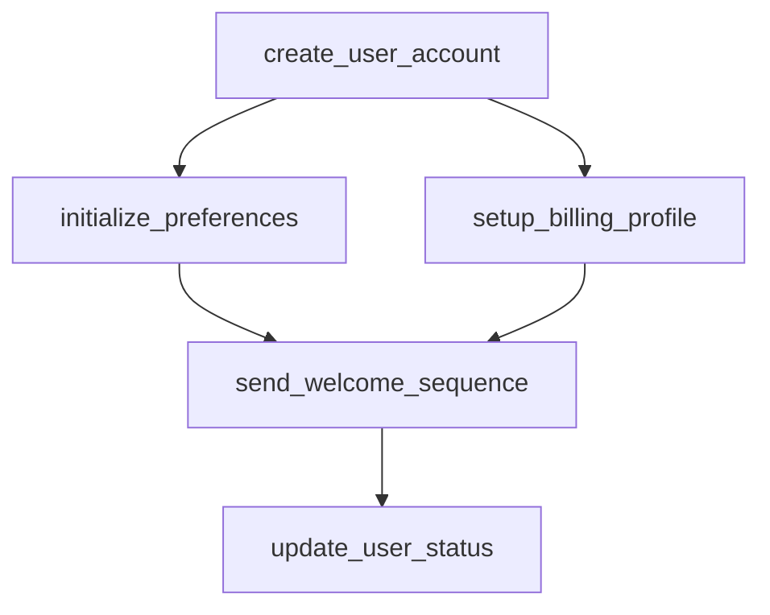

# user_registration

## Step Details

| Step | Type | Handler | Dependencies | Schema Fields | Retry |
|------|------|---------|--------------|---------------|-------|
| create_user_account | Standard | microservices_create_user_account | — | account_status, created_at, email, email_verified, full_name, internal_id, name, phone, plan, referral_code, source, status, user_id, username, verification_token | — |
| initialize_preferences | Standard | microservices_initialize_preferences | create_user_account | created_at, customizations, defaults_applied, feature_flags, notifications, onboarding_completed, plan, preferences, preferences_id, status, ui_settings, updated_at, user_id, user_internal_id | — |
| setup_billing_profile | Standard | microservices_setup_billing_profile | create_user_account | billing_cycle, billing_id, billing_required, billing_status, created_at, currency, features, limits, next_billing_date, payment_method_required, plan, price, pricing, status, subscription_id, trial_end, user_id, user_internal_id | — |
| send_welcome_sequence | Standard | microservices_send_welcome_sequence | setup_billing_profile, initialize_preferences | channels_used, messages_sent, messages_sent_details, plan, sent_at, sequence_id, status, total_messages, user_id, welcome_sequence_id | 2x exponential |
| update_user_status | Standard | microservices_update_user_status | send_welcome_sequence | account_status, activated_at, activation_timestamp, all_services_coordinated, billing_id, email, internal_id, onboarding_status, plan, registration_complete, registration_summary, services_completed, status, subscription_id, user_id, welcome_messages_sent | 2x exponential |
