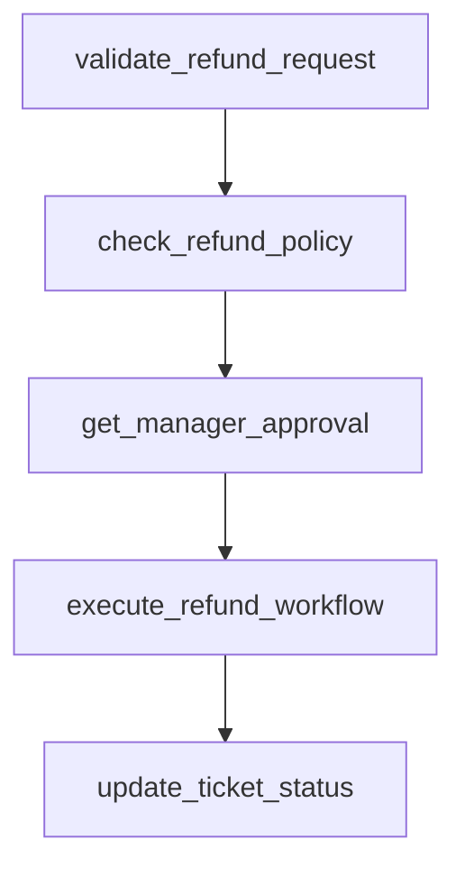

# process_refund

## Step Details

| Step | Type | Handler | Dependencies | Schema Fields | Retry |
|------|------|---------|--------------|---------------|-------|
| validate_refund_request | Standard | CustomerSuccess.StepHandlers.ValidateRefundRequestHandler | — | customer_id, customer_tier, namespace, original_purchase_date, payment_id, request_validated, ticket_id, ticket_status, validation_timestamp | — |
| check_refund_policy | Standard | CustomerSuccess.StepHandlers.CheckRefundEligibilityHandler | validate_refund_request | customer_tier, days_since_purchase, max_allowed_amount, namespace, policy_checked, policy_checked_at, policy_compliant, refund_window_days, requires_approval, within_refund_window | 2x exponential |
| get_manager_approval | Standard | CustomerSuccess.StepHandlers.CalculateRefundAmountHandler | check_refund_policy | approval_id, approval_obtained, approval_required, approved_at, auto_approved, manager_id, manager_notes, namespace | 1x linear |
| execute_refund_workflow | Standard | CustomerSuccess.StepHandlers.NotifyCustomerSuccessHandler | get_manager_approval | correlation_id, delegated_task_id, delegated_task_status, delegation_timestamp, namespace, target_namespace, target_workflow, task_delegated | — |
| update_ticket_status | Standard | CustomerSuccess.StepHandlers.UpdateCrmRecordHandler | execute_refund_workflow | delegated_task_id, namespace, new_status, previous_status, refund_completed, resolution_note, ticket_id, ticket_updated, updated_at | — |
