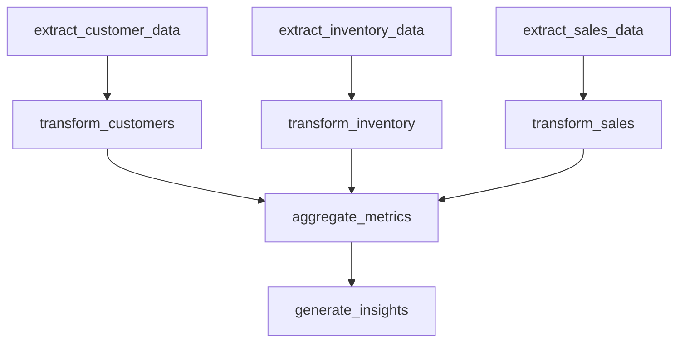

# analytics_pipeline

## Step Details

| Step | Type | Handler | Dependencies | Schema Fields | Retry |
|------|------|---------|--------------|---------------|-------|
| extract_customer_data | Standard | DataPipeline.StepHandlers.ExtractCustomerDataHandler | — | active_customers, avg_lifetime_value, churn_count, date_range, extracted_at, new_customers_in_period, records, region_breakdown, source, tier_breakdown, total_customers, total_lifetime_value | — |
| extract_inventory_data | Standard | DataPipeline.StepHandlers.ExtractInventoryDataHandler | — | extracted_at, include_archived, products_tracked, record_count, records, source, total_quantity, warehouse_count, warehouses | — |
| extract_sales_data | Standard | DataPipeline.StepHandlers.ExtractSalesDataHandler | — | date_range, extracted_at, extraction_sources, record_count, records, schema_version, source, total_amount | — |
| transform_customers | Standard | DataPipeline.StepHandlers.TransformCustomersHandler | extract_customer_data | avg_customer_value, record_count, region_distribution, source, tier_analysis, total_lifetime_value, transformation_type, transformed_at, value_segments | 2x exponential |
| transform_inventory | Standard | DataPipeline.StepHandlers.TransformInventoryHandler | extract_inventory_data | product_inventory, record_count, reorder_alerts, source, total_quantity_on_hand, transformation_type, transformed_at, warehouse_summary | 2x exponential |
| transform_sales | Standard | DataPipeline.StepHandlers.TransformSalesHandler | extract_sales_data | avg_transaction_value, daily_sales, product_sales, record_count, source, total_revenue, transformation_type, transformed_at, unique_categories | 2x exponential |
| aggregate_metrics | Standard | DataPipeline.StepHandlers.AggregateMetricsHandler | transform_sales, transform_inventory, transform_customers | aggregated_at, aggregation_complete, inventory_reorder_alerts, inventory_turnover_indicator, revenue_per_customer, sales_transactions, sources_included, total_customer_lifetime_value, total_customers, total_inventory_quantity, total_revenue | 2x exponential |
| generate_insights | Standard | DataPipeline.StepHandlers.GenerateInsightsHandler | aggregate_metrics | generated_at, health_score, insights, pipeline_complete, total_metrics_analyzed | 2x exponential |
