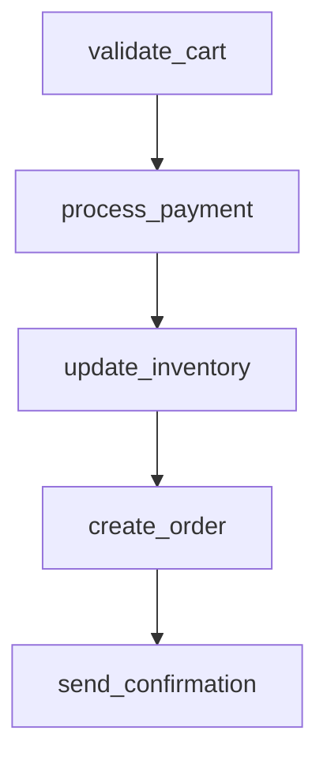

# ecommerce_order_processing

## Step Details

| Step | Type | Handler | Dependencies | Schema Fields | Retry |
|------|------|---------|--------------|---------------|-------|
| validate_cart | Standard | Ecommerce.StepHandlers.ValidateCartHandler | — | free_shipping, item_count, shipping, subtotal, tax, tax_rate, total, validated_items, validation_warnings | 2x exponential |
| process_payment | Standard | Ecommerce.StepHandlers.ProcessPaymentHandler | validate_cart | amount_charged, auth_code, authorized_at, card_last_four, currency, gateway, net_amount, payment_id, payment_method, processing_fee, status, transaction_id | 2x exponential |
| update_inventory | Standard | Ecommerce.StepHandlers.UpdateInventoryHandler | process_payment | all_items_available, inventory_log_id, reservation_expires_at, total_items_reserved, updated_at, updated_products | 2x exponential |
| create_order | Standard | Ecommerce.StepHandlers.CreateOrderHandler | update_inventory | created_at, customer_email, estimated_delivery, inventory_reservations, items, order_id, order_number, shipping, status, subtotal, tax, total_amount, transaction_id | 2x exponential |
| send_confirmation | Standard | Ecommerce.StepHandlers.SendConfirmationHandler | create_order | email_id, provider, recipient, sent_at, status, subject, template, template_data | 2x exponential |
