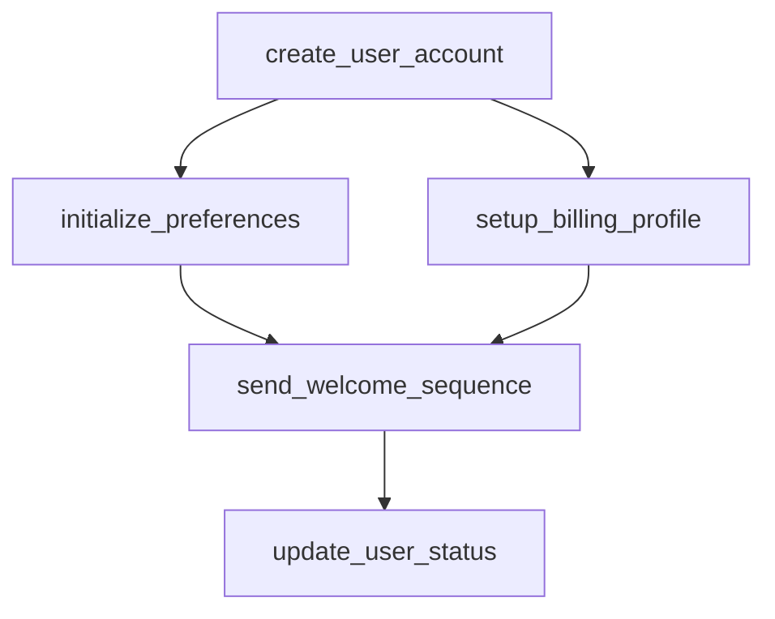

# user_registration

## Step Details

| Step | Type | Handler | Dependencies | Schema Fields | Retry |
|------|------|---------|--------------|---------------|-------|
| create_user_account | Standard | Microservices.StepHandlers.CreateUserHandler | — | api_key, auth_provider, created_at, email, name, phone, plan, source, status, user_id | — |
| initialize_preferences | Standard | Microservices.StepHandlers.InitPreferencesHandler | create_user_account | created_at, customizations, defaults_applied, plan, preferences, preferences_id, status, updated_at, user_id | — |
| setup_billing_profile | Standard | Microservices.StepHandlers.SetupBillingHandler | create_user_account | billing_cycle, billing_id, billing_required, created_at, currency, features, message, next_billing_date, plan, price, status, user_id | — |
| send_welcome_sequence | Standard | Microservices.StepHandlers.SendWelcomeHandler | setup_billing_profile, initialize_preferences | channels_used, messages_sent, plan, recipient, sent_at, status, user_id, welcome_sequence_id | 2x exponential |
| update_user_status | Standard | Microservices.StepHandlers.UpdateStatusHandler | send_welcome_sequence | activation_timestamp, all_services_coordinated, plan, registration_summary, services_completed, status, user_id | 2x exponential |
