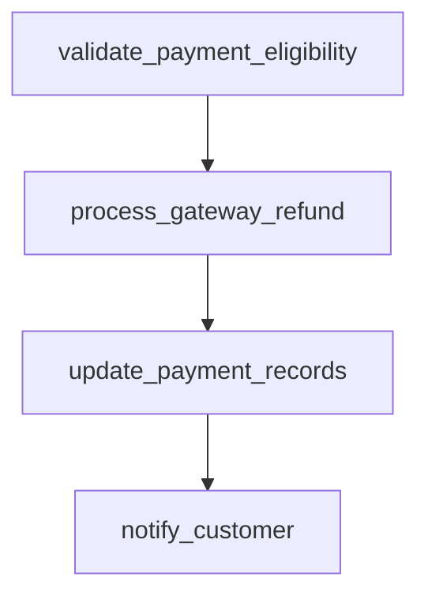

# process_refund

## Step Details

| Step | Type | Handler | Dependencies | Schema Fields | Retry |
|------|------|---------|--------------|---------------|-------|
| validate_payment_eligibility | Standard | Payments.StepHandlers.ProcessRefundPaymentHandler | — | eligibility_status, gateway_provider, namespace, original_amount, payment_id, payment_method, payment_validated, refund_amount, validation_timestamp | — |
| process_gateway_refund | Standard | Payments.StepHandlers.UpdateLedgerHandler | validate_payment_eligibility | estimated_arrival, gateway_provider, gateway_transaction_id, namespace, payment_id, processed_at, refund_amount, refund_id, refund_processed, refund_status | 2x exponential |
| update_payment_records | Standard | Payments.StepHandlers.ReconcileAccountHandler | process_gateway_refund | history_entries_created, namespace, payment_id, payment_status, record_id, records_updated, refund_id, refund_status, updated_at | — |
| notify_customer | Standard | Payments.StepHandlers.GenerateRefundReceiptHandler | update_payment_records | customer_email, delivery_status, message_id, namespace, notification_sent, notification_type, refund_amount, refund_id, sent_at | 5x exponential |
