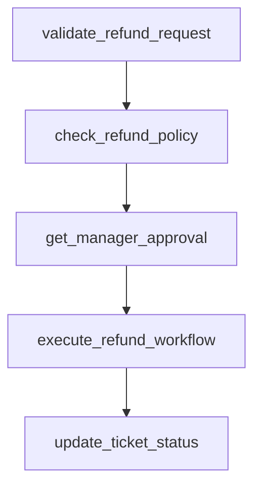

# process_refund

## Step Details

| Step | Type | Handler | Dependencies | Schema Fields | Retry |
|------|------|---------|--------------|---------------|-------|
| validate_refund_request | Standard | validate_refund_request | — | amount, customer_email, customer_id, customer_tier, eligible, namespace, order_ref, original_purchase_date, payment_id, reason, request_id, request_validated, ticket_id, ticket_status, validated_at, validation_hash, validation_timestamp | — |
| check_refund_policy | Standard | check_refund_policy | validate_refund_request | amount_tier, approval_path, checked_at, customer_tier, days_since_purchase, max_allowed_amount, namespace, policy_checked, policy_checked_at, policy_compliant, policy_id, policy_version, refund_window_days, request_id, requires_approval, requires_review, rules_applied, within_refund_window | 2x exponential |
| get_manager_approval | Standard | get_manager_approval | check_refund_policy | amount_approved, approval_id, approval_note, approval_obtained, approval_path, approval_required, approved, approved_at, approver, auto_approved, manager_id, manager_notes, namespace, request_id | 1x linear |
| execute_refund_workflow | Standard | execute_refund_workflow | get_manager_approval | amount_refunded, correlation_id, currency, delegated_task_id, delegated_task_status, delegation_timestamp, estimated_arrival, executed_at, namespace, order_ref, refund_id, refund_method, request_id, status, target_namespace, target_workflow, task_delegated, transaction_ref | — |
| update_ticket_status | Standard | update_ticket_status | execute_refund_workflow | amount_refunded, customer_notified, delegated_task_id, namespace, new_status, notification_channel, previous_status, refund_completed, refund_id, request_id, resolution, resolution_note, resolved_at, ticket_id, ticket_status, ticket_updated, updated_at | — |
