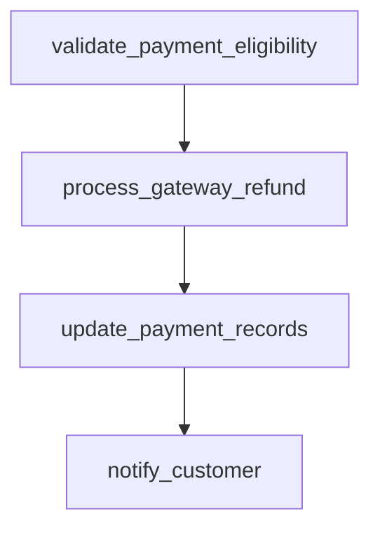

# process_refund

## Step Details

| Step | Type | Handler | Dependencies | Schema Fields | Retry |
|------|------|---------|--------------|---------------|-------|
| validate_payment_eligibility | Standard | validate_payment_eligibility | — | amount, customer_email, eligibility_id, eligibility_status, eligible, fraud_flagged, fraud_score, gateway_provider, namespace, order_ref, original_amount, payment_id, payment_method, payment_validated, reason, refund_amount, refund_percentage, validated_at, validation_timestamp, within_refund_window | — |
| process_gateway_refund | Standard | process_gateway_refund | validate_payment_eligibility | amount_processed, authorization_code, currency, estimated_arrival, gateway, gateway_provider, gateway_status, gateway_transaction_id, gateway_txn_id, namespace, order_ref, payment_id, processed_at, processor_message, processor_response_code, refund_amount, refund_id, refund_processed, refund_status, settlement_batch, settlement_id | 2x exponential |
| update_payment_records | Standard | update_payment_records | process_gateway_refund | amount_recorded, fiscal_period, gateway_txn_id, history_entries_created, journal_id, ledger_entries, namespace, order_ref, payment_id, payment_status, reconciliation_status, record_id, recorded_at, records_updated, refund_id, refund_status, updated_at | — |
| notify_customer | Standard | notify_customer | update_payment_records | body_preview, channel, customer_email, delivery_status, message_id, namespace, notification_id, notification_sent, notification_type, recipient, references, refund_amount, refund_id, sent_at, status, subject, template | 5x exponential |
