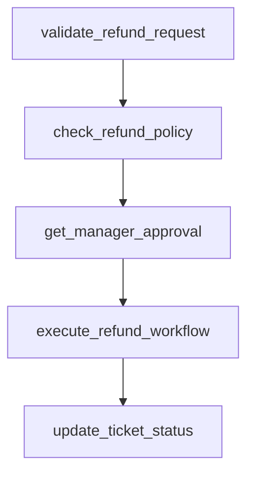

# process_refund

## Step Details

| Step | Type | Handler | Dependencies | Schema Fields | Retry |
|------|------|---------|--------------|---------------|-------|
| validate_refund_request | Standard | CustomerSuccess::StepHandlers::ValidateRefundRequestHandler | — | customer_id, customer_tier, is_partial_refund, is_valid, namespace, order_data, order_ref, original_purchase_date, payment_id, reason, refund_amount, refund_percentage, request_validated, ticket_id, ticket_status, validated_at, validation_id, validation_timestamp | — |
| check_refund_policy | Standard | CustomerSuccess::StepHandlers::CheckRefundPolicyHandler | validate_refund_request | applied_policy, approval_level, auto_approve, check_id, checked_at, customer_tier, days_since_purchase, max_allowed_amount, namespace, policy_checked, policy_checked_at, policy_compliant, policy_passed, refund_window_days, requires_approval, requires_manager_approval, violations, warnings, within_refund_window | 2x exponential |
| get_manager_approval | Standard | CustomerSuccess::StepHandlers::GetManagerApprovalHandler | check_refund_policy | approval_id, approval_level, approval_obtained, approval_required, approved, approved_at, auto_approved, conditions, decided_at, decided_by, decision_type, denial_reason, manager, manager_id, manager_notes, namespace, priority, reason, requesting_agent | 1x linear |
| execute_refund_workflow | Standard | CustomerSuccess::StepHandlers::ExecuteRefundWorkflowHandler | get_manager_approval | all_steps_completed, amount_refunded, conditions_applied, correlation_id, customer_id, delegated_task_id, delegated_task_status, delegation_timestamp, executed, executed_at, execution_id, namespace, order_ref, payment_method, refund_transaction_id, steps_executed, target_namespace, target_workflow, task_delegated, total_steps | — |
| update_ticket_status | Standard | CustomerSuccess::StepHandlers::UpdateTicketStatusHandler | execute_refund_workflow | customer_facing_message, delegated_task_id, follow_up_required, internal_notes, namespace, new_status, previous_status, refund_completed, resolution_category, resolution_note, satisfaction_survey_scheduled, ticket_id, ticket_status, ticket_updated, timeline, update_id, updated_at | — |
