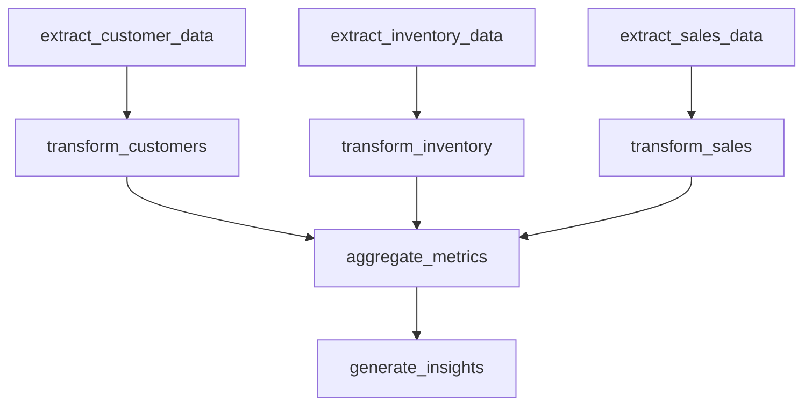

# analytics_pipeline

## Step Details

| Step | Type | Handler | Dependencies | Schema Fields | Retry |
|------|------|---------|--------------|---------------|-------|
| extract_customer_data | Standard | DataPipeline::StepHandlers::ExtractCustomerDataHandler | — | average_lifetime_value, avg_lifetime_value, engagement_rate, extracted_at, extraction_id, record_count, records, segment_distribution, source, tier_breakdown, total_customers, total_lifetime_value | — |
| extract_inventory_data | Standard | DataPipeline::StepHandlers::ExtractInventoryDataHandler | — | extracted_at, extraction_id, items_needing_reorder, products_tracked, record_count, records, source, total_inventory_value, total_quantity, warehouses, warehouses_covered | — |
| extract_sales_data | Standard | DataPipeline::StepHandlers::ExtractSalesDataHandler | — | date_range, extracted_at, extraction_id, record_count, records, source, total_amount, total_revenue | — |
| transform_customers | Standard | DataPipeline::StepHandlers::TransformCustomersHandler | extract_customer_data | at_risk_customer_count, avg_customer_value, channel_metrics, churn_risk_rate, overall_engagement_rate, record_count, region_metrics, segment_metrics, source, source_record_count, tier_analysis, tier_metrics, total_lifetime_value, transform_id, transformation_type, transformed_at, value_segments | 2x exponential |
| transform_inventory | Standard | DataPipeline::StepHandlers::TransformInventoryHandler | extract_inventory_data | category_metrics, product_inventory, record_count, reorder_alerts, source, source_record_count, total_inventory_value, total_quantity_on_hand, total_skus, transform_id, transformation_type, transformed_at, warehouse_metrics, warehouse_summary | 2x exponential |
| transform_sales | Standard | DataPipeline::StepHandlers::TransformSalesHandler | extract_sales_data | channel_metrics, daily_sales, product_metrics, product_sales, record_count, region_metrics, source, source_record_count, top_product, top_region, total_revenue, transform_id, transformation_type, transformed_at | 2x exponential |
| aggregate_metrics | Standard | DataPipeline::StepHandlers::AggregateMetricsHandler | transform_sales, transform_inventory, transform_customers | aggregated_at, aggregation_complete, aggregation_id, breakdowns, data_sources, health_scores, highlights, inventory_reorder_alerts, inventory_turnover_indicator, revenue_per_customer, sales_transactions, sources_included, summary, total_customer_lifetime_value, total_customers, total_inventory_quantity, total_revenue | 2x exponential |
| generate_insights | Standard | DataPipeline::StepHandlers::GenerateInsightsHandler | aggregate_metrics | business_health, component_scores, critical_items, data_freshness, generated_at, health_score, insight_count, insights, overall_score, pipeline_complete, recommendation_count, recommendations, report_id, total_metrics_analyzed | 2x exponential |
