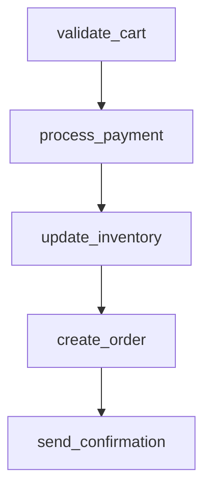

# ecommerce_order_processing

## Step Details

| Step | Type | Handler | Dependencies | Schema Fields | Retry |
|------|------|---------|--------------|---------------|-------|
| validate_cart | Standard | Ecommerce::StepHandlers::ValidateCartHandler | — | free_shipping, item_count, shipping, subtotal, tax, tax_rate, total, validated_at, validated_items, validation_id | 2x exponential |
| process_payment | Standard | Ecommerce::StepHandlers::ProcessPaymentHandler | validate_cart | amount_charged, authorization_code, currency, gateway_response_code, last_four, payment_id, payment_method_type, processed_at, status, transaction_id | 2x exponential |
| update_inventory | Standard | Ecommerce::StepHandlers::UpdateInventoryHandler | process_payment | all_items_reserved, inventory_changes, inventory_log_id, reservation_expires_at, reservation_id, total_items_reserved, updated_at, updated_products | 2x exponential |
| create_order | Standard | Ecommerce::StepHandlers::CreateOrderHandler | update_inventory | created_at, customer_email, estimated_delivery, estimated_shipping_days, inventory, items, order_id, order_number, payment, shipping, shipping_address, status, subtotal, tax, total_amount | 2x exponential |
| send_confirmation | Standard | Ecommerce::StepHandlers::SendConfirmationHandler | create_order | all_delivered, confirmation_sent_at, email_body_preview, email_sent, email_subject, email_type, message_id, notifications_sent, order_id, recipient, sent_at, total_channels | 2x exponential |
