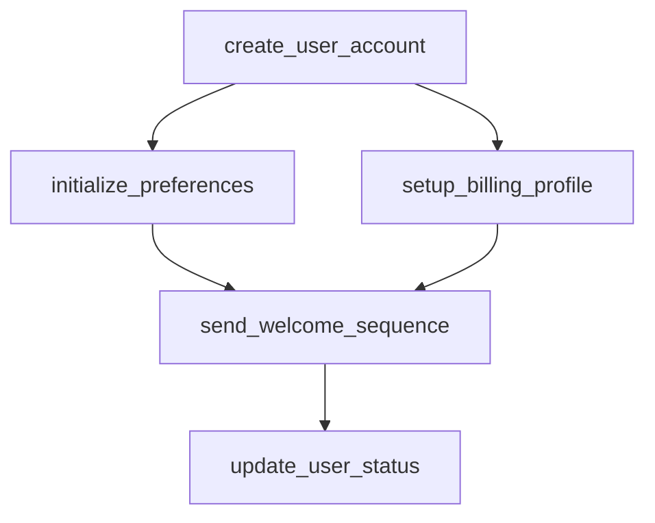

# user_registration

## Step Details

| Step | Type | Handler | Dependencies | Schema Fields | Retry |
|------|------|---------|--------------|---------------|-------|
| create_user_account | Standard | Microservices::StepHandlers::CreateUserAccountHandler | — | account_status, created_at, email, email_verified, name, plan, referral_code, referral_valid, status, user_id, username, verification_token | — |
| initialize_preferences | Standard | Microservices::StepHandlers::InitializePreferencesHandler | create_user_account | created_at, customizations, defaults_applied, feature_flags, initialized_at, plan, preferences, preferences_id, quotas, status, updated_at, user_id | — |
| setup_billing_profile | Standard | Microservices::StepHandlers::SetupBillingProfileHandler | create_user_account | annual_price, billing_cycle, billing_id, billing_status, created_at, currency, features, monthly_price, next_billing_date, payment_method_required, plan, price, status, subscription_id, trial_days, trial_end_date, user_id | — |
| send_welcome_sequence | Standard | Microservices::StepHandlers::SendWelcomeSequenceHandler | setup_billing_profile, initialize_preferences | all_delivered, channels_used, drip_campaign, email, messages_sent, notifications_sent, plan, sent_at, sequence_id, status, total_notifications, user_id, welcome_sequence_completed_at, welcome_sequence_id | 2x exponential |
| update_user_status | Standard | Microservices::StepHandlers::UpdateUserStatusHandler | send_welcome_sequence | activated_at, activation_timestamp, all_services_coordinated, next_steps, onboarding_score, plan, profile_summary, registration_complete, registration_steps, registration_summary, services_completed, status, user_id | 2x exponential |
