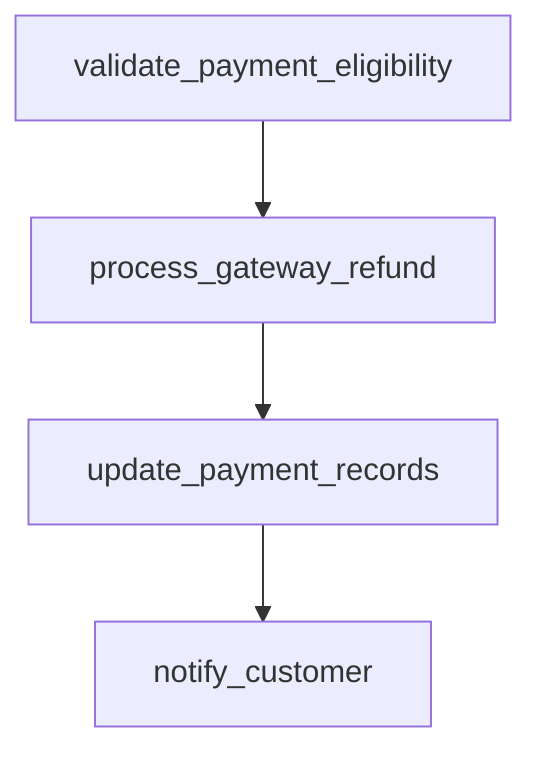

# process_refund

## Step Details

| Step | Type | Handler | Dependencies | Schema Fields | Retry |
|------|------|---------|--------------|---------------|-------|
| validate_payment_eligibility | Standard | Payments::StepHandlers::ValidatePaymentEligibilityHandler | — | currency, eligibility_id, eligibility_status, eligible, gateway_provider, idempotency_key, is_duplicate, namespace, original_amount, original_payment, payment_id, payment_method, payment_validated, reason, refund_amount, refund_history, validated_at, validation_timestamp, within_refund_window | — |
| process_gateway_refund | Standard | Payments::StepHandlers::ProcessGatewayRefundHandler | validate_payment_eligibility | currency, estimated_arrival, gateway, gateway_fee, gateway_provider, gateway_request_id, gateway_response, gateway_transaction_id, idempotency_key, namespace, net_refund_amount, payment_id, processed_at, processing_time_ms, refund_amount, refund_id, refund_processed, refund_status, settlement, status | 2x exponential |
| update_payment_records | Standard | Payments::StepHandlers::UpdatePaymentRecordsHandler | process_gateway_refund | accounting_impact, all_successful, history_entries_created, ledger_entry_id, namespace, payment_id, payment_status, record_id, record_update_id, records_updated, records_updated_details, refund_id, refund_status, total_records, updated_at | — |
| notify_customer | Standard | Payments::StepHandlers::NotifyCustomerHandler | update_payment_records | all_sent, channels_used, currency, customer_email, delivery_status, message_id, namespace, notification_id, notification_sent, notification_type, notifications, notified_at, payment_id, refund_amount, refund_id, sent_at, settlement_info, total_notifications | 5x exponential |
